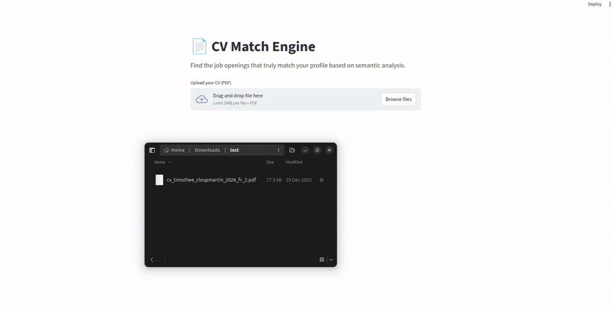

# CVEE: CV-Embedding Engine 🚀
**CVEE** is an AI-powered job matching system that leverages embeddings to find the most relevant job opportunities based on uploaded CVs. It integrates data from the France Travail API, processes job descriptions using sentence transformers, and stores embeddings in a PostgreSQL database with pgvector for efficient similarity searches.

---
  
<!--  -->
<p align="center">
  
  <br>
  <b>End-to-end CV parsing and real-time vector matching</b>
</p>

---


## ✨ Features
* **Job Data Ingestion**: Fetches job listings from the France Travail API and stores them in a structured format.
* **Embedding Generation**: Uses the BAAI/bge-small-en model to create 384-dimensional embeddings for job descriptions and CVs.
* **Vector Search**: Performs cosine similarity searches on embeddings to match CVs with jobs.
* **Web Interface**: A Streamlit-based UI for uploading PDFs and viewing top matching jobs.
* **Scalable Deployment**: Kubernetes manifests for containerized deployment with PostgreSQL, API, and UI services.
* **Data Pipeline**: Automated workflows using CronJobs for data ingestion and synchronization.

---

## 🏗️ Architecture

The system is built on a modular microservices architecture:

| Component | Technology | Description |
| :--- | :--- | :--- |
| **API** | FastAPI | Handles CV text extraction, embedding generation, and search queries. |
| **UI** | Streamlit | Frontend for user interaction and result display. |
| **Database** | PostgreSQL + pgvector | Stores structured job data and high-dimensional vectors. |
| **Processing** | Jupyter/Databricks | Notebooks for Silver/Gold data layers (ingestion & embedding). |
| **Storage** | AWS S3 | Remote storage for raw and processed datasets. |
| **Orchestration** | Kubernetes | Manages container lifecycles and service scaling. |

---
  
<!--  -->
<p align="center">
  
  <br>
  <b>Data Pipeline and System Architecture</b>
</p>

---

## ⚙️ Installation

### Prerequisites
* Python 3.11+
* Docker
* Kubernetes cluster (e.g., Minikube for local testing)
* AWS account with S3 bucket
* Databricks account
* France Travail API credentials

### Local Setup
1.  **Clone the repository:**
    ```bash
    git clone https://github.com/timotheeCloup/CVEE.git
    cd CVEE
    ```

2.  **Install dependencies:**
    ```bash
    pip install -r requirements.txt
    ```

3.  **Environment Variables:**
    Set up environment variables in a `.env` file (see example in `sync_s3_to_postgres.py`).


### Kubernetes Deployment
1.  **Apply secrets and namespace:**
    ```bash
    kubectl apply -f k8s/namespace.yaml
    kubectl apply -f k8s/secrets.yaml
    ```

2.  **Deploy services:**
    ```bash
    kubectl apply -f k8s/
    ```

3.  **Access the UI:**
    Open `http://<node-ip>:30081` in your browser.

---

## 🚀 Usage

1.  **Upload** a PDF CV via the Streamlit UI.
2.  The **API** extracts text, generates embeddings, and queries the database for top matches.
3.  **View results** with direct links to job postings on France Travail.

---

## 🤝 Contributing

Contributions are welcome! Please open issues or submit pull requests to help improve the portability and features of CVEE.

