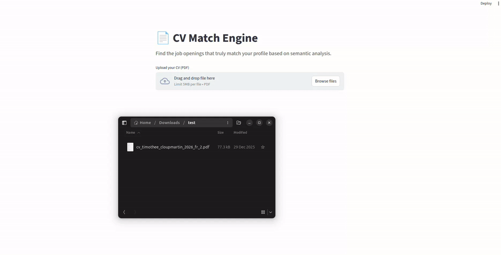

# CVEE: CV-Embedding Engine

Traditional job boards match you based on keywords. CVEE is fundamentally different—it analyzes your complete CV to understand who you really are, then finds the roles that truly align with your profile, skills, and experience in seconds using semantic search.

**CVEE** is an AI-powered job matching system that combines semantic embeddings and full-text search to find the most relevant job opportunities based on uploaded CVs. It integrates data from the France Travail API, processes job descriptions using sentence transformers, and stores embeddings in a PostgreSQL database with pgvector for efficient hybrid similarity searches.

Try it now: [CV Match Engine](https://cvee-ui-1081304882492.europe-west1.run.app/)

[](https://github.com/timotheeCloup/CVEE/actions/workflows/ci.yaml)

---

<p align="center">
  
  <br>
  <b>End-to-end CV parsing and real-time vector matching</b>
</p>

---

## Features

- **Intelligent Job Matching** - Combines semantic embeddings and full-text search for accurate results
- **Real-Time Search** - Upload your CV and get matched jobs in seconds
- **Automated Data Pipeline** - Daily ingestion from France Travail API with PySpark transformation
- **Vector Database** - Supabase PostgreSQL with pgvector for efficient similarity queries on 384-dimensional embeddings
- **Professional UI** - Clean Streamlit interface with direct job posting links
- **Serverless Scalability** - Google Cloud Run deployment with auto-scaling

---

## Architecture

The system follows a modern data pipeline architecture with clear separation of concerns:

<p align="center">
  
  <br>
  <b>Data Pipeline and System Architecture</b>
</p>

### System Components

| Component | Technology | Purpose |
| :--- | :--- | :--- |
| **API Service** | FastAPI + Cloud Run | Handles CV parsing, embedding generation, and hybrid search queries |
| **Web UI** | Streamlit + Cloud Run | User-friendly interface for CV upload and results visualization |
| **Vector Database** | Supabase (PostgreSQL + pgvector) | Stores structured job data and 384-dimensional embeddings |
| **Data Processing** | PySpark + Databricks | ETL pipelines for data transformation and embedding generation |
| **Cloud Storage** | AWS S3 | Raw job data, intermediate processed datasets, and backups |
| **Orchestration** | Google Cloud Scheduler + Cloud Functions | Automated daily data sync and API ingestion |

### Data Flow Pipeline

1. **API Ingestion** (Cloud Function) - France Travail API → AWS S3 (Bronze layer)
2. **Data Transformation** (Databricks) - Bronze → Silver (cleaning, deduplication, French→English translation)
3. **Embedding Generation** (Databricks) - Silver → Gold (BAAI/bge-small-en model)
4. **Database Sync** (Cloud Function) - AWS S3 (Gold) → Supabase PostgreSQL
5. **User Query** - CV upload → FastAPI → Hybrid search → Streamlit UI

### Hybrid Search Algorithm

The matching combines two complementary approaches:

- **Semantic Matching** - Cosine similarity between CV and job embeddings using [BAAI/bge-small-en](https://huggingface.co/BAAI/bge-small-en)
- **Full-Text Search** - PostgreSQL ts_rank on job descriptions with weighted tsvector levels
- **Result Ranking** - Combined score balances both signals for optimal relevance

---

## Technology Stack

### Backend & API
- **FastAPI** - Modern, async web framework for the search API
- **Python 3.11** - Primary language for all services
- **PyPDF2** - CV text extraction from PDF files
- **Sentence Transformers** - BAAI/bge-small-en for embedding generation (384 dims)
- **scikit-learn** - Cosine similarity calculations

### Data & Storage
- **Supabase (PostgreSQL 16)** - Vector database with pgvector extension
- **AWS S3** - Object storage for Bronze/Silver/Gold datasets
- **Parquet** - Columnar format for efficient data processing
- **pandas + PyArrow** - Data manipulation and format conversion

### Data Processing & ML
- **PySpark** - Distributed computing for large-scale data transformation
- **Databricks** - Managed platform for notebook execution and job orchestration
- **Google Cloud Translate API** - French → English text translation
- **Hugging Face** - Pre-trained sentence transformer models

### Deployment & Cloud Infrastructure
- **Google Cloud Run** - Serverless container hosting (API & UI)
- **Google Cloud Functions** - Serverless compute for ETL pipelines
- **Google Cloud Scheduler** - Cron-based job orchestration
- **Docker** - Containerization of all services

### Frontend
- **Streamlit** - Lightweight framework for data-driven web app
- **Requests** - HTTP client for API communication

### DevOps & CI/CD
- **GitHub Actions** - Automated API health checks on every push
- **Docker** - Container images for Cloud Run deployment

---

## Project Structure

```
CVEE/
├── api/                                    # FastAPI Service
│   ├── app.py                             # Main API endpoints (/health, /embed-cv)
│   ├── embed_cv_search.py                 # Hybrid search logic
│   ├── utils.py                           # Database queries, PDF extraction
│   ├── stopwords.json                     # French stopwords for FTS
│   ├── Dockerfile                         # Cloud Run image
│   └── requirements.txt
│
├── ui/                                     # Streamlit Web Interface
│   ├── app.py                             # Streamlit UI application
│   ├── Dockerfile                         # Cloud Run image
│   └── requirements.txt
│
├── src/
│   ├── cf-api-to-s3/                      # Cloud Function: API → S3
│   │   ├── main.py                        # Cloud Function entry point
│   │   ├── api_to_s3_loader.py           # France Travail API fetcher
│   │   └── requirements.txt
│   │
│   ├── cf-ingest-db/                      # Cloud Function: S3 → Supabase
│   │   ├── main.py                        # Cloud Function entry point
│   │   ├── sync_s3_to_supabase.py        # S3 to PostgreSQL sync logic
│   │   └── requirements.txt
│   │
│   ├── jobs_ingestion_silver.ipynb        # Databricks: Bronze → Silver
│   ├── jobs_embeddings_gold.ipynb         # Databricks: Silver → Gold (embeddings)
│   └── jobs_export.ipynb                  # Databricks: Export to S3
│
└── .github/
    └── workflows/ci.yaml                  # GitHub Actions health checks
```

---


## License

MIT License - See [LICENSE](LICENSE) file for details.